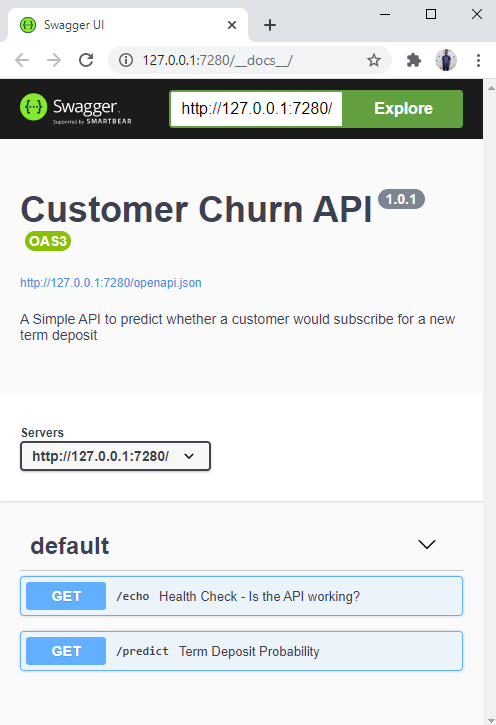

```{r setup, include=FALSE}
knitr::opts_chunk$set(echo = FALSE)
```
<p> Today, I am going to be covering the steps I took in order to create this simple <a href = ""> API </a> which shows the probabilities of customers reaction to subscribing for a new Bank Term Deposit in a simple bar plot using the {plumber} package, extra packages used for this project were {tidyverse},{tidymodels} and {scales} </p>

<p> This post doesn't cover the Exploratory Data Analysis and Model Development, links to those can be found <a href = "">here</a> and <a href = "">here</a>. In future, I wish to send this API to an android developer for further implementations. </p>

<p> After creating a new Plumber API script, the first step is to load the required libraries and the saved prediction model from before. </p>
The _model_ variable was commented because i didn't have the model saved in this directory.

```{r echo=TRUE, message=FALSE, warning=FALSE}
library(plumber)
library(tidyverse)
library(tidymodels)
library(scales)

#model <- read_rds("term_deposit_model.rds")
```

<p> Next step, which is totally optionally, is to create a simple "Health Status" function, just to make sure that everything is functioning properly. A tip i learnt from James Blaire & Barret Schloerke's video on Integrating R with Plumber APIs | Rstudio (2020), link <a href = "">here</a> </p>

```{r echo=TRUE, message=FALSE, warning=FALSE, results="hide"}

#* @apiTitle Customer Churn API
#* @apiDescription A Simple API to predict whether a customer would subscribe for a new term deposit
#* @apiVersion  1.0.1


#* Health Check - Is the API working?
#* @get /echo
function() {
    list(msg = "Todo Bien",
         time = Sys.time())
}

```

<p> The last part of this project is to create a function that takes in the values, makes a prediction and returns a plot. There are several ways to go about this but, this was the quickest i could think. In due time, I'd find a much more efficient way on going about this. </p>

```{r echo=TRUE, warning=FALSE, results="hide"}

#* Term Deposit Probability
#* @param a Age
#* @param b Job
#* @param c Marital
#* @param d Education
#* @param e Default (yes or no)
#* @param f Balance
#* @param g Housing (yes or no)
#* @param h Loan (yes or no)
#* @param i Contact
#* @param j Day (day in a month)
#* @param k Month
#* @param l Duration
#* @param m Campaign
#* @param n Pdays
#* @param o Previous
#* @param p Poutcome

#* @response Job Jobs are: unemployed, services, management, blue-collar, self-employed,technician, entrepreneur, admin, student, housemaid, retired.
#* @response Contact Contacts are: cellular, unknown, telephone
#* @response Month Months in jan,feb,mar,apr,may,jun,jul,aug,sep,oct,nov,dec
#* @response Poutcome Poutcome in unknown,failure,other,success
#* @response Marital married,single,divorced
#* @response Education primary,secondary,tertiary
#* @serializer png
#* @get /predict

function(a,b,c,d,e,f,g,h,i,j,k,l,m,n,o,p) {
  
   df <- tibble(
      age =as.numeric(a), job = as.character(b),
      marital = as.character(c), education =  as.character(d),
      default = as.character(e), balance = as.numeric(f),
      housing = as.character(g), loan = as.character(h),
      contact = as.character(i), day = as.numeric(j),
      month = as.character(k), duration = as.numeric(l),
      campaign = as.numeric(m), pdays = as.numeric(n),
      previous = as.numeric(o), poutcome = as.character(p)
    ) %>%
     mutate_if(is.character,str_to_lower)
   
    
    
    
   prob_result <- predict(model, df, type = "prob")
    
    
   prob_plot <- prob_result %>%
    gather() %>%
    mutate(key = str_sub(key, start = 7, end = 10) %>% str_to_sentence()) %>%
    ggplot(aes(key, value, fill = key)) +
    geom_col(show.legend = F) +
    scale_y_continuous(labels = percent_format()) +
    scale_fill_manual(values = c("#6E0808", "#179944"))+
    labs(title = "Probability Plot",
         x = NULL,
         y = NULL,
         caption = "plot: @EmmanuelUgo | data: NHJL Bank")+
     theme_minimal()
    
    print(prob_plot)
    

    }
```

This Interface of the API:



